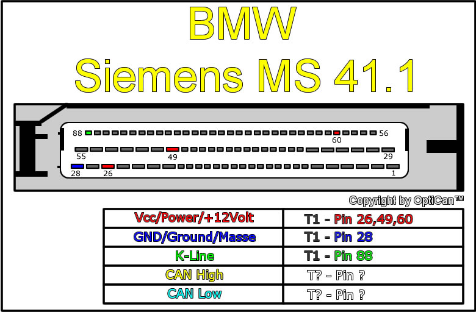
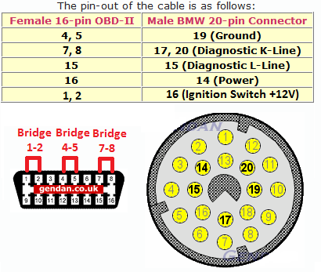
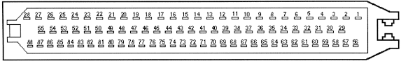
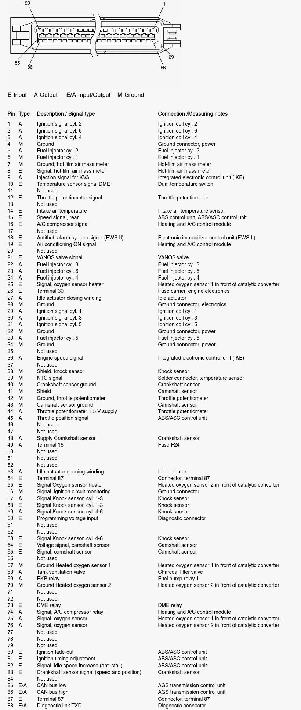

## Projet dashboard lecteur

Projet de création d'un dashboard via tablette pour l'affichage des informations moteur en direct pour remplacer l'instalation de manomettre.

#### Véhicule :
-   BMW serie 3 1995 convertible
-   code chassis E36
-   328I 
-   code Moteur M52B28 2.8L essence 6 cylindres simple vanos
-   DME (ECU) Siemens MS41

#### Communication DME

La communication avec le DME Siemens s'effectue via le protocole ISO 9141 via la broche K-line
Le modèle BMW E36 ne dispose pas d'une prise OBD2 d'origine une modification du faisceau d'origine est requis 

connecteur DME
-   88 => Blanc-violet = K-line
-   49 => Vert = +12V
-   60 => Vert-Bleu = +12V
-   28 => Marron-Orange = Masse
-   26 => Rouge = +12V

connection prise OBD II
-   4-5 => Masse
-   7 => K-line
-   16 => +12V

### Schema DME X6000 DME control unit - Siemens MS41

